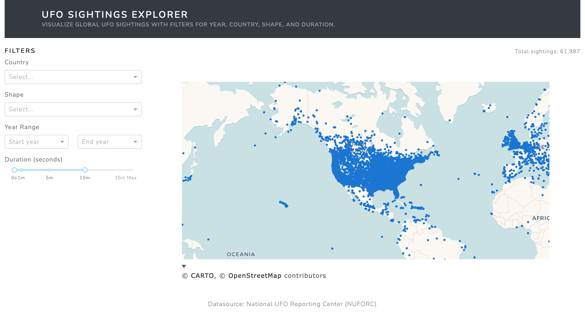
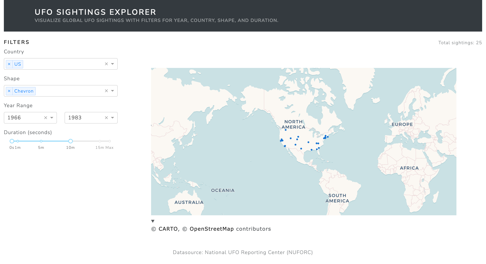
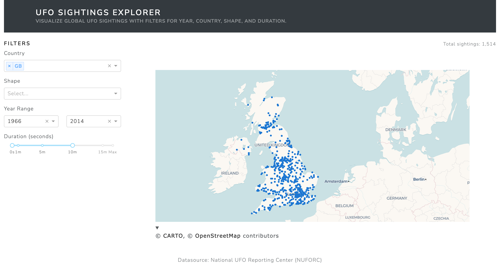

# 🛸 UFO Sightings Dashboard

This project presents a data visualization dashboard exploring patterns in reported UFO sightings across the world. It was developed as part of a visual storytelling assessment, with the goal of transforming cluttered or static data representations into clear and insightful visuals.

## 📊 Overview

The dashboard allows users to explore UFO sighting reports, filter them by time and location, and discover interesting regional and temporal trends. It is based on a cleaned dataset of reported sightings and aims to answer key questions like:

- Where are UFO sightings most commonly reported?
- How have sighting frequencies changed over time?

All visualizations were developed using Python, Plotly, and Dash, and are presented in a clean, responsive layout.

## 📅 Design and Visualization Choices

The original dataset was difficult to interpret due to its tabular format and volume. The redesigned dashboard includes:

- A map view for observations
- Dropdowns and date pickers to filter by year, region, and shape

Each chart uses contrasting but accessible colors, simplified axes, and a clear layout to prioritize interpretability.

## 📊 Dataset

The dataset is sourced from a cleaned version of the NUFORC UFO sightings log.

- Fields include date, city, state, country, shape, and duration of the sighting.
- Dataset is stored locally in `data/scrubbed.csv`

> Note: Due to GitHub limitations, the dataset is not tracked in the repository. Users should download or place their copy in the `data/` folder.

## 🚀 Getting Started

1. Clone the repo:

```bash
git clone https://github.com/wiederstrom/UFO.git
cd UFO
```

2. Create and activate a conda environment (optional but recommended):

```bash
python3 -m venv venv
source venv/bin/activate
```

3. Install dependencies:

```bash
pip install -r requirements.txt
```

4. Run the app:

```bash
python app.py
```

5. Open browser at: `http://127.0.0.1:8050`

## 📸 Screenshot





## 📂 Project Structure

```
UFO/
├── app.py               # Dash app
├── data/                # Contains scrubbed.csv
├── screenshots/         # Project visuals
├── README.md            # This file
└── .gitignore
```

## ✍️ Author

**Erik Lunde Wiederstrøm**\
Bachelor in Applied Data Science, 2025\
[LinkedIn](https://linkedin.com/in/wiederstrom)
